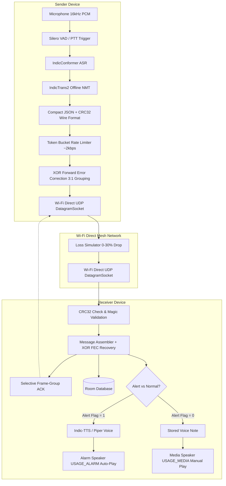

# iTantra - Developer Handover & Complete Testing Guide
**SIH26173 | ISRO | Offline Emergency Voice Communicator & Mesh Translator**

---

## 📌 1. Project Overview & Architecture

**iTantra** is a mission-critical, zero-cloud, offline emergency voice communication system built for disaster relief and isolated operations under the Smart India Hackathon (SIH26173) ISRO problem statement. It enables real-time, low-bitrate (~2 kbps) voice transcription, neural machine translation across Indian languages, text-to-speech synthesis, and reliable mesh communication over Wi-Fi Direct UDP datagrams.



---

## 🛠️ 2. How to Open the Project in Android Studio

### Prerequisites
- **Android Studio**: Ladybug / Quail (2024.2.1+) or newer.
- **Java Development Kit (JDK)**: **JDK 17** (Temurin / OpenJDK 17).
- **Android SDK**: Compile SDK 35 (Android 15), Min SDK 26 (Android 8.0 Oreo).
- **Gradle & AGP**: Gradle 8.11.1 & AGP 8.7.3 (Kotlin 2.0.21).
- **NDK**: Installed via SDK Manager for `arm64-v8a` and `x86_64` ABIs.

### Step-by-Step Import
1. Launch Android Studio.
2. Click **Open** (or `File -> Open`).
3. Browse to and select the project directory:
   ```
   c:\Users\Agnesh\Desktop\sih
   ```
4. Wait for Android Studio to load the project files.
5. **Configure the Gradle JDK**:
   - Go to `File -> Settings` (on Windows) or `Android Studio -> Settings` (on macOS).
   - Navigate to **Build, Execution, Deployment -> Build Tools -> Gradle**.
   - Under **Gradle JDK**, select **JDK 17** (e.g., `Embedded JDK version 17` or your installed OpenJDK 17).
   - Click **Apply** and **OK**.
6. **Sync Gradle**:
   - Click the **Sync Project with Gradle Files** button in the top toolbar (elephant icon with blue arrow), or go to `File -> Sync Project with Gradle Files`.
   - Ensure the build completes without errors.

---

## 🧪 3. What to Test & How to Test

### Test Suite 1: Automated Unit Tests (JVM)
The project includes a comprehensive JUnit test suite covering all critical protocol, FEC, retransmission, and AI safety logic.

#### How to run in Android Studio:
1. In the **Project** tool window (left panel), expand:
   `app -> src -> test -> java -> com.itantra.app`
2. Right-click on the `com.itantra.app` package or any individual test file and select **Run 'Tests in 'com.itantra.app''** (or press `Ctrl + Shift + F10`).
3. Verify all test cases pass with green checkmarks.

#### What each test verifies:
| Test File | Verification Scope | Expected Result |
| :--- | :--- | :--- |
| [`PacketWireFormatTest.kt`](file:///c:/Users/Agnesh/Desktop/sih/app/src/test/java/com/itantra/app/PacketWireFormatTest.kt) | Packet serialization, deserialization, Magic header (`IT`), CRC32 corruption detection, ACK payload packing. | **PASS**: Throws `SecurityException` on 1-bit CRC mismatch; preserves all flags. |
| [`FecEngineTest.kt`](file:///c:/Users/Agnesh/Desktop/sih/app/src/test/java/com/itantra/app/FecEngineTest.kt) | XOR Parity frame generation, reconstruction of missing frame in 3-frame group, detection of >1 unrecoverable packet loss. | **PASS**: Reconstructs missing byte payloads perfectly; returns `null` when 2 frames lost. |
| [`MessageAssemblerTest.kt`](file:///c:/Users/Agnesh/Desktop/sih/app/src/test/java/com/itantra/app/MessageAssemblerTest.kt) | Out-of-order packet reassembly, duplicate packet rejection, and 15-second inactivity timeout. | **PASS**: Duplicate packets ignored; timeouts fire at 15s mark. |
| [`AckRetryManagerTest.kt`](file:///c:/Users/Agnesh/Desktop/sih/app/src/test/java/com/itantra/app/AckRetryManagerTest.kt) | Round-Trip Time (RTT) Exponential Moving Average (EMA), timeout formula ($2 \times RTT$), 3 selective retries before timeout. | **PASS**: Re-transmits only lost group up to 3 times, then triggers timeout. |
| [`LossSimulatorTest.kt`](file:///c:/Users/Agnesh/Desktop/sih/app/src/test/java/com/itantra/app/LossSimulatorTest.kt) | Synthetic packet drop rates (0% to 30%); verifies `HELLO` and `ACK` are never dropped. | **PASS**: 0% drops for control packets; statistically valid drops for data. |
| [`SafeTranslationFallbackTest.kt`](file:///c:/Users/Agnesh/Desktop/sih/app/src/test/java/com/itantra/app/SafeTranslationFallbackTest.kt) | Same-language translation bypass, failure fallback retaining transcript, and TTS phonetic guardrail. | **PASS**: TTS blocked if translation fails to prevent gibberish voice synthesis. |

---

### Test Suite 2: Interactive In-App Verification (Diagnostics Screen)
When running the app on a physical device or emulator, navigate to the **Diagnostics Screen** (wrench/build icon in the top bar):

1. **UDP Packet Loss Simulator**:
   - Toggle the switch **ON** and slide the loss rate slider up to **30%**.
   - Send voice messages or component tests.
   - Observe the live badges: `Simulated Drops`, `Pending ACK Groups`, `Retransmissions`, and `Timeouts`.
2. **Component Test Buttons**:
   - **Test VAD**: Injects synthetic 16kHz PCM audio and validates speech onset & silence threshold detection.
   - **Test ASR**: Transcribes sample audio using IndicConformer and computes word-level confidence flags.
   - **Test IndicTrans2**: Runs multilingual NMT translation between selected source & target languages.
   - **Test TTS**: Synthesizes 16 kHz 16-bit mono WAV voice notes.
   - **Test Playback**: Plays audio through the hardware audio output.
   - **Full Loop**: Executes complete end-to-end capture $\to$ ASR $\to$ NMT $\to$ Wire Packet $\to$ TTS $\to$ Playback cycle.

---

### Test Suite 3: End-to-End Mesh Testing on Two Devices
To test real Wi-Fi Direct mesh communication:
1. Install the APK on **two Android devices** (Device A and Device B).
2. Launch iTantra on both devices and grant requested permissions:
   - Microphone (`RECORD_AUDIO`)
   - Nearby Wi-Fi Devices (`NEARBY_WIFI_DEVICES`)
   - Location (`ACCESS_FINE_LOCATION`)
3. Ensure Wi-Fi is enabled on both phones (no internet router required; Wi-Fi Direct connects peer-to-peer).
4. On Device A: Select **Source Language = Hindi**, **Target Language = Tamil**.
5. Hold the **Microphone Button** (Push-To-Talk) or toggle **HANDS-FREE**.
6. Speak a message and release the button.
7. Observe Device B:
   - In **Normal Mode**: Receives message, shows translation in conversation list, and allows tapping to play synthesized voice.
   - In **Alert Mode**: Automatically overrides volume and speaks the emergency message via `USAGE_ALARM`.

---

## 🐍 4. Python AI Model Conversion Tooling

The repository includes conversion scripts in [`tools/`](file:///c:/Users/Agnesh/Desktop/sih/tools) to export AI4Bharat models to mobile-ready ONNX models.

### Installation
```bash
pip install -r requirements.txt
```

### Conversion Commands
```bash
# 1. Export IndicConformer ASR model for Hindi (or ta, gu, mr, kn, ml, te, or, bn, en)
python tools/export_indicconformer.py --lang hi --out ./exported_models

# 2. Export IndicTrans2 NMT model (indic-indic, indic-en, or en-indic)
python tools/export_indictrans2.py --variant indic-indic --out ./exported_models

# 3. Export Indic-TTS model
python tools/export_indictts.py --lang hi --out ./exported_models
```

---

## 📋 5. Roadmap & What Needs to Be Done Next

For any engineer or AI coding agent continuing this work:

1. **Deploy Production ONNX Weights**:
   - Run the export tools with access to HuggingFace / NeMo checkpoints.
   - Place optimized `.onnx` models into `app/src/main/assets/models/` or configure the on-demand download manager in [`ModelManager.kt`](file:///c:/Users/Agnesh/Desktop/sih/app/src/main/java/com/itantra/app/domain/model/ModelManager.kt).
2. **Multi-Hop Mesh Relay**:
   - Extend [`WiFiDirectUdpTransport.kt`](file:///c:/Users/Agnesh/Desktop/sih/app/src/main/java/com/itantra/app/transport/wifi/WiFiDirectUdpTransport.kt) with routing tables for >2 nodes acting as autonomous mesh repeaters.
3. **Hardware Battery Optimization**:
   - Add wake-lock throttling when Wi-Fi Direct is in idle listening state.
4. **Offline Map / GPS Coordinates Attachment**:
   - The packet header flags have reserved bits to attach optional offline GPS coordinates to emergency alert packets.

---

## 🤖 6. Guidelines for Future AI Coding Agents
- **Strict Offline Guarantee**: Do NOT introduce cloud API endpoints, remote HTTP servers, or external telemetry libraries.
- **Safety Fallback Principle**: If translation fails or confidence is low, the original transcript MUST be preserved, and TTS MUST NOT synthesize text into mismatched phonemes.
- **Low-Bitrate Constraint**: Maintain wire packets under MTU (1200 bytes) and rate limiting within 1..10,000 bps token bucket limits.

---

## 🚀 7. Running the Project on Another Machine / Device

When the next engineer or coding agent receives this project:

### 1. In Android Studio:
1. Open **Android Studio** (Ladybug 2024.2+ or newer).
2. Click **Open** and select the project directory: `c:\Users\Agnesh\Desktop\sih`.
3. Set **Gradle JDK** to **JDK 17** (`Settings -> Build, Execution, Deployment -> Build Tools -> Gradle -> Gradle JDK`).
4. Click **Sync Project with Gradle Files** (Elephant icon).
5. Connect an Android device (or launch an emulator) and press **Run** (`Shift + F10`).

### 2. From Command Line (Windows PowerShell / CMD):
```powershell
# Run all unit tests
.\gradlew.bat testDebugUnitTest

# Build debug APK
.\gradlew.bat assembleDebug

# Install on connected device
adb install -r app\build\outputs\apk\debug\app-debug.apk
```

### 3. Running Unit Tests in Android Studio:
In the project tree, right-click on the test package:
`app -> src -> test -> java -> com.itantra.app` $\to$ **Run 'Tests in 'com.itantra.app''**.
